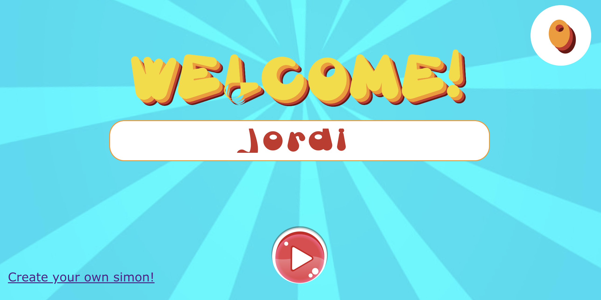

# Me presento

¡Hola! Gracias por pasarte por aquí. 

Me llamo Jordi. Puedes conocerme más leyendo esta página que he creado.

# Qué hago

Me gusta enfocarme en resolver problemas complejos a través del uso creativo de la tecnología, y a ser posible,
que generen un impacto medible en personas que conozco.

Por eso, soy desarrollador de software. Hago aplicaciones que funcionan principalmente en web, móvil y
sobre asistentes de voz. 

Profesionalmente, participo en el Grupo INIT desde 2006. Actualmente me enfoco en ayudar a
las grandes empresas a configurar e implementar sus planes de salud de forma eficiente, a través
de la plataforma Inithealth.

# Qué cosas he hecho

En mi tiempo libre, hago muchas cosas, quizás en exceso, como un medio para aprender sobre el estado
actual de la tecnología. La mayoría de estos aprendizajes los publico en mi [Github](https://github.com/jmarti-theinit){:target="_blank"} o en mi [Medium](https://medium.com/@itortv){:target="_blank"}

Aquí un listado de ellas. En orden cronológico de más reciente a menos (aproximadamente).

## SCURE: Aventuras Conversacionales en Google Assistant

Mezcla en una coctelera: (1) Aventura conversacional, (2) Google Assistant, y 
(3) tiempo límite como en un escape room. 

¿El resultado? Los desarrollos más recientes y que más orgulloso estoy. Con una cantidad de conversaciones en
torno a las 1.000 - 2.000 diarias en cada uno de estos juegos.

Actualmente, tengo tres juegos:

- Remoto Interfaz de Conciencia. [https://www.ric-escape.com/](https://www.ric-escape.com/)
- La Anomalía Dimensional. [https://the-anomaly-game.com/](https://the-anomaly-game.com/)
- La Mansión de los Espíritus. [https://mansion-espiritus.com/](https://mansion-espiritus.com/)

Crear estos juegos me ha permitido generar mi propio motor de generación de aventuras para Google Assistant, llamado
SCURE. ¡Hacer aventuras conversacionales para Google Assistant ahora es tan fácil como hacer un JSON!

SCURE: [https://github.com/jmarti-theinit/scure-dialogflow](https://github.com/jmarti-theinit/scure-dialogflow)

## Los viajes de Coco

¡Localiza a Coco en Bretaña y Normandía! Coco se esconde detrás de las 18 fotografías de este magnífico lugar.

Gracias a esto, aprendí sobre PhaserJS y reflexioné si tenía sentido o no hacer TDD.

Además, saqué un buen juego para mis sobrinos.

Juego online: [bit.ly/viajesdecoco](bit.ly/viajesdecoco)
Repositorio: [https://github.com/jmarti-theinit/viajes-de-coco](https://github.com/jmarti-theinit/viajes-de-coco)

## Hacer TDD es fácil si sabes cómo, aka "Engánchate al verde"

Una serie de artículos escritos en Google Drive para compartir:

- (1) por qué hacer TDD, y
- (2) cómo hacerlo.

Es todo lo que me hubiera gustado saber para comenzar y quitarle el miedo. Estoy orgulloso del resultado, aunque
creo que con tanto nuevo framework de javascript, se va a quedar obsoleto pronto. Lo hice para demostrar que, aunque
tu código sea legacy con jQuery también puedes hacerlo, y para demostrar que si haces con AngularJS 1.5, es fácil.

¿Quizás debería hacer uno de VueJS? ¿Una versión más actual de Angular? Soy todo oídos. Be my guest.

Artículos en drive: [https://drive.google.com/drive/folders/0B5V6zjUzJ7TDZkZNQUd2eUFVQ0U](https://drive.google.com/drive/folders/0B5V6zjUzJ7TDZkZNQUd2eUFVQ0U)

## Tooché

Un intento de hacer un proyecto con una comunidad detrás. Lo tengo algo abandonado, y sin embargo, quiero retomarlo
alguna vez.

El juego me parece interesante. La dinámica también. La comunidad de unas (pocas pero interesantes) personas en torno
a él también.

¿Qué me frena? Principalmente, que es el primer desarrollo que hago donde noto que para avanzar, debe haber un equipo
de gente detrás: diseño, ilustraciones,  arte creativo, teoría de gamificación. Todo esto es necesario para
conseguir hacer algo relevante y de impacto con este juego.

Tecnologías: PhaserJS.

Aquí el hilo donde comparto todos los posts: [https://twitter.com/itortv/status/961715774753857536](https://twitter.com/itortv/status/961715774753857536)

Aquí el repo:
(1) Prototipo: [https://github.com/jmarti-theinit/tooche](https://github.com/jmarti-theinit/tooche)
(2) Versión muy preliminar: [https://github.com/jmarti-theinit/tooche-game](https://github.com/jmarti-theinit/tooche-game)

## Cypress Cucumber skeleton

Tras implementar satisfactoriamente Cypress + Cucumber en nuestro flujo de desarrollo, escribí uno de mis posts
más exitosos hasta la fecha. 

Post medium: [https://medium.com/@itortv/how-to-integrate-cypress-and-cucumber-in-your-development-flow-in-just-a-few-weeks-96a46ac9165a](https://medium.com/@itortv/how-to-integrate-cypress-and-cucumber-in-your-development-flow-in-just-a-few-weeks-96a46ac9165a)

Repositorio: [https://github.com/jmarti-theinit/cypress-cucumber-example](https://github.com/jmarti-theinit/cypress-cucumber-example)

## Simonly

Tengo 9 sobrinos/as. Un día durante el 2017 les dije: “Os voy a hacer un juego en el que vosotros seáis los protagonistas”.
Dicho y hecho. Hoy tienen un juego en el que cada uno de ellos es una nota musical (do, re, mi, fa, …), y la mecánica
del juego es la del mítico Simón: el jugador tiene que ir recordando la melodía a medida que va progresando y
alargándose.

¡Mis sobrinos ya tienen su propia app!

Como no quiero publicar fotos de mis sobrinos, hice una versión “Chiquito” para mostrar el potencial del juego.
Y ahora, el juego es totalmente customizable. ¡No requieres tener un servidor para hacer tu propio Simonly!

Todo el código es libre. ¡Entra y sírvete tú mismo!
(1) Juega al Simon con Chiquito,
(2) Hazte tu propio Simon,
(3) Mira todo el código (hecho en Vuejs y fully TDD).

Repositorio: [https://github.com/jmarti-theinit/simonly](https://github.com/jmarti-theinit/simonly)

## Zorionak

Una app en la que cada día muestra una foto diferente. La hicimos entre todos los hijos de la familia (¡somos 5 hijos/as!)
como regalo de aniversario de nuestros padres, y cada día muestra una foto familiar diferente. Se ha convertido en una
tradición familiar, y este año ya hemos sacado la segunda renovación de la app (mis hermanas buscan las fotos, yo
las compilo en la app). Todas las mañanas a través del whatsapp comentamos la foto de la app. Si alguien quiere su
propia app de Zorionak, que me contacte, y por un módico precio, se la personalizo :)

## TCR Cli

Experimenté un poco sobre el Test && (Commit | | Revert) propuesto por Kent Beck.

Aquí los resultados:

- Kata Mars Rover: desarrollada mediante TCR. [https://github.com/jmarti-theinit/tcr-mars-rover](https://github.com/jmarti-theinit/tcr-mars-rover)
- TCR Cli: Utilities para línea de comandos para desarrollar sobre TCR. [https://github.com/jmarti-theinit/tcr-cli](https://github.com/jmarti-theinit/tcr-cli)

## Katayuno Escape

Hasta la fecha, hemos desarrollado dos Katayuno Escape: dos experiencias Escape Room en formato kata. ¡Ideal para
aprender sobre TDD y divertirse!

Las experiencias pueden recrearse en cualquier entorno, ya que el código está libre, junto a sus instrucciones
y todo.

- Katayuno Escapecraft, Pamplona Crafters 2018 edition: [https://github.com/jmarti-theinit/katayuno-escapecraft](https://github.com/jmarti-theinit/katayuno-escapecraft)
- Katayuno Escape Room Edition 2017: [https://github.com/jmarti-theinit/katayuno-escape-countdown](https://github.com/jmarti-theinit/katayuno-escape-countdown)

Todas estas experiencias son replicables. Si necesitas ayuda, ¡contáctame!

Gracias a @ojoven, @gonzalo123 y @540info por haber participado en éstas conmigo.

## Karmacracy

Un pet project que creció a empresa, pero no escaló. Buscábamos medir la relevancia de las personas, impulsando el uso
de la herramienta a través de la gamificación.

Un modelo de negocio fallido, aunque yo siempre recalco que hicimos algo
que nadie más ha podido hacer: Si invertías 50 euros, conseguías unas 100 personas medianamente relevantes en las redes
sociales compartiendo en sus redes el link que tú proponías.

El modelo de negocio tuvo impacto, pero no conseguimos escalarlo.

## itortv.com

El origen de mi nick en twitter. 

Un buscador de series y subtítulos en la época Lost. Una aplicación web y móvil que me permitió conocer
 a fondo Android nativo, y gracias al cual Google me regaló un móvil.  Tuve más de 10.000 usuarios. Incluso llegó a
 estar la app en algunas ROMs prefabricadas. Estoy muy orgulloso de haber encontrado una necesidad (principalmente la
 mía), resolverla, abrir la solución al resto y ver que otra gente la adoptaba. Tras la aparición de la Ley Sinde,
 lo apagué. Justo en ese momento, aparecieron unas soluciones más sociales, que hubieran sido la evolución de itortv.
  
Algunos links al respecto:

- Tutorial: [https://www.youtube.com/watch?v=Grr33QG7B6E](https://www.youtube.com/watch?v=fL0_hdo84Xs).
- ¿Tiene LODVG el guión de Lost? [https://www.youtube.com/watch?v=Grr33QG7B6E](https://www.youtube.com/watch?v=Grr33QG7B6E). Un vídeo que pretendía ser viral, en la era pre-meme. Incluso LODVG llegó a escribirme. Eran otros tiempos :) 
- Enlace en El Androide Libre: [https://elandroidelibre.elespanol.com/2010/07/gestiona-tus-series-con-mitortv.html](https://elandroidelibre.elespanol.com/2010/07/gestiona-tus-series-con-mitortv.html)

